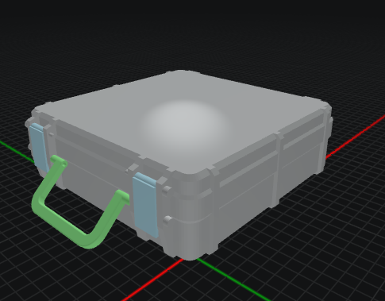
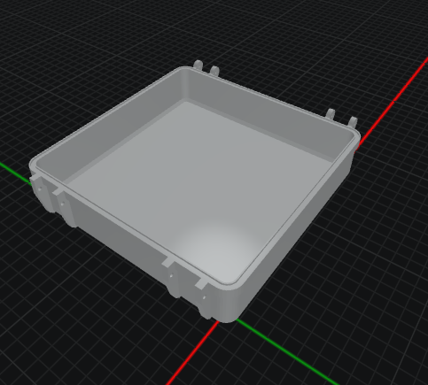
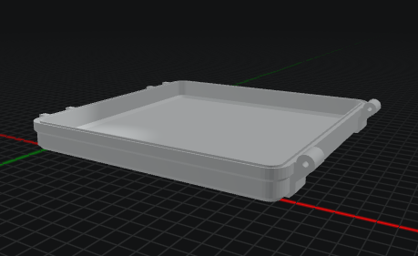
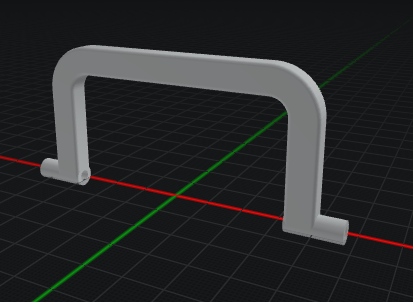
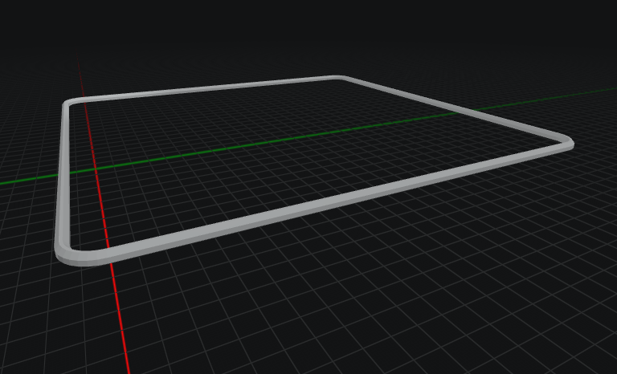

## Parameterized Rugged Case for OpenSCAD

This project is a fully parametric rugged-style case designed in OpenSCAD.
You can generate a complete assembly for preview, or export individual printable parts such as:

- base
- top
- latches
- handle
- seal
- hinge screw
- latch screw

The model is driven by variables in the OpenSCAD Customizer, so you can tune dimensions, wall thickness, latch geometry, hinge fit, and seal behavior for your own use case and printer tolerances.

But why? Well, I started this sometime in 2022, maybe 2021. As a direct result of fighting with Fusion 360 and a desire to unlink myself from commercial subscription software usage. This became especially important after Autodesk paywalled previously free features.

So, I decided to learn OpenSCAD. How hard can it be, right?
Anyway, I got to the point where I'd created the base, hinges, support ribs, and latch ribs. At that point I just ran out of steam. I'd created a monster. I could barely follow my own code, purely because I used a lot of hard coded points in space and 2D arrays of data points. I posted to Reddit about this time, and people liked it as it created the whole base and top of the box, just lacked latches, but no one offered to assist. I removed it and put it on the back burner.

Sometime in 2024 I came back to it and started to un-frack it. But again, after a while I ran out of steam and still hadn't even created the latches.

Then came 2026, I was designing a lunchbox (don't ask) and needed a case. Well, what do you know. I have one of those already - but it wasn't finished. Nevermind, I found a couple of other OpenSCAD rugged case designs online. Except they didn't fit my requirements, had their own issues I'd need to fix, and I just didn't want to accept defeat.

So I returned to this. I thought I could get co-pilot to do some jobs for me, but yeah-nah, co-pilot did its usual of turning a working model into pure trash. So into the dustbin of history that branch went. I had to do it myself.

Hundreds of saves and dozens of commits later, I'd finally done what I started out to do 4 years prior. Co-pilot helped me with figuring out some positioning problems in the assembly view, but other than that, it was hard mode.

There's still plenty of things I need to fix, but for today, I'm done.
At some point I need to look into the remaining hard coded parts, also look at splitting the data point arrays into smaller segments. Either that or bypass them and use object primitives like a normal person.

## Preview

### Full Assembly

### Individual Parts

## Quick Start

1. Open `case.scad` in OpenSCAD.
2. Open the Customizer panel.
3. Set dimensions and feature values to suit your build.
4. Choose what to generate with the `run` selector:
	- `assembly` for a full preview
	- `base`, `top`, `latches`, `handle`, `seal`, `hinge_screw`, or `latch_screw` for exportable parts
5. Render (`F6`) and export to STL or 3MF.

## Notes

- The model is intended to be edited parametrically, not by direct mesh editing.
- Fit-critical values (clearances, hole diameters, seal undersizing) may need tuning for different printers and materials.

## Support

If you like the design, you are welcome to buy me a coffee:

## Licence

CC – Attribution – Non-Commercial (CC BY-NC): Users can remix and build upon my model, but only for non-commercial purposes. Credit must be provided. (I literally stole this licence text)